# 地图纪｜预告篇：植物调绘的日常

<section style="box-sizing: border-box;"><section class="Powered-by-XIUMI V5" style="box-sizing: border-box;" powered-by="xiumi.us"><section class="" style="margin: 0.5em 0px;box-sizing: border-box;"><section class="" style="background-color: rgb(160, 160, 160);height: 1px;box-sizing: border-box;"></section></section></section><section class="Powered-by-XIUMI V5" style="box-sizing: border-box;" powered-by="xiumi.us"><section class="" style="margin-top: 10px;margin-bottom: 10px;box-sizing: border-box;"><section class="" style="display: inline-block;width: 100%;border-width: 1px;border-style: solid;border-color: rgb(226, 226, 226);padding: 10px;box-shadow: rgb(226, 226, 226) 0px 16px 1px -13px;box-sizing: border-box;"><section class="Powered-by-XIUMI V5" style="box-sizing: border-box;" powered-by="xiumi.us"><section class="" style="box-sizing: border-box;"><section class="" style="font-size: 14px;box-sizing: border-box;">
暮春出门调查最讨厌的就是蚊子了！（和密集的树丛并列排在第一位！）
</section></section></section><section class="Powered-by-XIUMI V5" style="box-sizing: border-box;" powered-by="xiumi.us"><section class="" style="text-align: center;margin-top: 10px;margin-bottom: 10px;box-sizing: border-box;"><section class="" style="max-width: 100%;vertical-align: middle;display: inline-block;overflow: hidden !important;box-sizing: border-box;"></section></section></section><section class="Powered-by-XIUMI V5" style="box-sizing: border-box;" powered-by="xiumi.us"><section class="" style="box-sizing: border-box;"><section class="" style="font-size: 14px;box-sizing: border-box;">
但是不要紧，我们已经克服了狂风暴雨烈日飞虫，把校园全部调查完辣！公众号将会陆续放出同济大学四平路校区的71张植物地图。（欢迎喜欢逛校园认植物的小可爱们加入我们的推送队伍呀⊙∀⊙！） 

 
</section></section></section></section></section></section><section class="Powered-by-XIUMI V5" style="box-sizing: border-box;" powered-by="xiumi.us"><section class="" style="margin: 0.5em 0px;box-sizing: border-box;"><section class="" style="background-color: rgb(160, 160, 160);height: 1px;box-sizing: border-box;"></section></section></section><section class="Powered-by-XIUMI V5" style="box-sizing: border-box;" powered-by="xiumi.us"><section class="" style="margin-top: 10px;margin-bottom: 10px;box-sizing: border-box;"><section class="" style="display: inline-block;width: 100%;border-width: 1px;border-style: solid;border-color: rgb(226, 226, 226);padding: 10px;box-shadow: rgb(226, 226, 226) 0px 16px 1px -13px;box-sizing: border-box;"><section class="Powered-by-XIUMI V5" style="box-sizing: border-box;" powered-by="xiumi.us"><section class="" style="box-sizing: border-box;"><section class="" style="font-size: 14px;box-sizing: border-box;">
emmm……举个栗子

下面是03号地图
</section></section></section></section></section></section><section class="Powered-by-XIUMI V5" style="box-sizing: border-box;" powered-by="xiumi.us"><section class="" style="margin-top: 10px;margin-bottom: 10px;text-align: center;box-sizing: border-box;"><section class="" style="display: inline-block;vertical-align: middle;box-sizing: border-box;"><section style="height: 5px;line-height: 5px;box-sizing: border-box;"><section style="padding-right: 8px;padding-left: 3px;display: inline-block;vertical-align: bottom;background-color: rgb(255, 255, 255);box-sizing: border-box;">    <section style="clear: both;box-sizing: border-box;"></section></section></section><section class="" style="border-top: 1px solid rgb(210, 210, 210);border-bottom: 1px solid rgb(210, 210, 210);margin: -3px 0px;padding: 3px 6px;box-sizing: border-box;">
中法中心 &amp; 旭日楼
</section><section style="height: 5px;line-height: 5px;box-sizing: border-box;"><section style="padding-right: 8px;padding-left: 3px;display: inline-block;vertical-align: top;background-color: rgb(255, 255, 255);box-sizing: border-box;">    </section><section style="clear: both;box-sizing: border-box;"></section></section></section></section></section><section class="Powered-by-XIUMI V5" style="box-sizing: border-box;" powered-by="xiumi.us"><section class="" style="text-align: center;margin-top: 10px;margin-bottom: 10px;box-sizing: border-box;"><section class="" style="max-width: 100%;vertical-align: middle;display: inline-block;box-shadow: rgb(0, 0, 0) 0px 0px 0px;overflow: hidden !important;box-sizing: border-box;">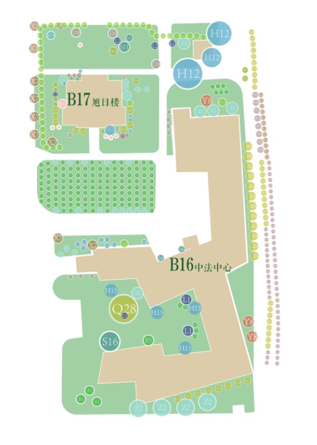</section></section></section><section class="Powered-by-XIUMI V5" style="box-sizing: border-box;" powered-by="xiumi.us"><section class="" style="margin-top: 10px;margin-bottom: 10px;box-sizing: border-box;"><section class="" style="display: inline-block;width: 100%;border-width: 1px;border-style: solid;border-color: rgb(226, 226, 226);padding: 10px;box-shadow: rgb(226, 226, 226) 0px 16px 1px -13px;box-sizing: border-box;"><section class="Powered-by-XIUMI V5" style="box-sizing: border-box;" powered-by="xiumi.us"><section class="" style="box-sizing: border-box;"><section class="" style="font-size: 14px;box-sizing: border-box;">
植物调绘呢，就是对着画好的打印好的地图，将实地的植物一株株地标在地图上面。植物种类很多，我就用序号来代替啦。调绘过程中最头疼的，就是密集的植物丛。往往因为地图比例太小，图纸上没有足够的空间，无从将植物全部标在最准确的位置上。因此最终绘制的植物地图中，植物的位置，和它实际的位置，可能会差数米。

 
</section></section></section></section></section></section><section class="Powered-by-XIUMI V5" style="box-sizing: border-box;" powered-by="xiumi.us"><section class="" style="margin-top: 10px;margin-bottom: 10px;box-sizing: border-box;"><section class="" style="display: inline-block;width: 100%;border-width: 1px;border-style: solid;border-color: rgb(226, 226, 226);padding: 10px;box-shadow: rgb(226, 226, 226) 0px 16px 1px -13px;box-sizing: border-box;"><section class="Powered-by-XIUMI V5" style="box-sizing: border-box;" powered-by="xiumi.us"><section class="" style="box-sizing: border-box;"><section class="" style="font-size: 14px;box-sizing: border-box;">
像黄杨&nbsp;<em>Buxus sinica</em>啊水杉<em>&nbsp;Metasequoia glyptostroboides</em>啊，这些都是校园内比较常见的植物。地图中不太常见的，主要有以下几种：

梅&nbsp;<em style="box-sizing: border-box;">Armeniaca &nbsp;mume</em>

蒲苇&nbsp;<em style="box-sizing: border-box;">Cortaderia selloana</em>

榔榆&nbsp;<em style="box-sizing: border-box;">Ulmus parvifolia</em>

玉簪&nbsp;<em style="box-sizing: border-box;">Hosta &nbsp;plantaginea</em>

杜英&nbsp;<em style="letter-spacing: 0px;box-sizing: border-box;">Elaeocarpus &nbsp;decipiens</em>

<em style="letter-spacing: 0px;box-sizing: border-box;"></em>酸枣&nbsp;<em style="box-sizing: border-box;">Ziziphus &nbsp;jujuba</em> var. <em style="box-sizing: border-box;">spinosa</em>

合欢&nbsp;<em style="letter-spacing: 0px;box-sizing: border-box;">Albizia julibrissin</em>

阔叶箬竹&nbsp;<em style="letter-spacing: 0px;box-sizing: border-box;">Indocalamus &nbsp;latifolius</em>

关节酢浆草&nbsp;<em style="box-sizing: border-box;">Oxalis &nbsp;articulata</em>

单瓣白木香&nbsp;<em style="letter-spacing: 0px;box-sizing: border-box;">Rosa &nbsp;banksiae </em>var.<em style="letter-spacing: 0px;box-sizing: border-box;"> normalis</em>
</section></section></section></section></section></section><section class="Powered-by-XIUMI V5" style="box-sizing: border-box;" powered-by="xiumi.us"><section class="" style="margin-top: 10px;margin-bottom: 10px;box-sizing: border-box;"><section class="" style="display: inline-block;width: 100%;border-width: 1px;border-style: solid;border-color: rgb(226, 226, 226);padding: 10px;box-shadow: rgb(226, 226, 226) 0px 16px 1px -13px;box-sizing: border-box;"><section class="Powered-by-XIUMI V5" style="box-sizing: border-box;" powered-by="xiumi.us"><section class="" style="box-sizing: border-box;"><section class="" style="font-size: 14px;box-sizing: border-box;">
那就随我来吧~

 

中法中心南侧庭院里，白色的鹅卵石和古铜色的墙面映衬着淡雅素净的蒲苇，十分具有美感。
</section></section></section></section></section></section><section class="Powered-by-XIUMI V5" style="box-sizing: border-box;" powered-by="xiumi.us"><section class="" style="text-align: center;margin-top: 10px;margin-bottom: 10px;box-sizing: border-box;"><section class="" style="max-width: 100%;vertical-align: middle;display: inline-block;overflow: hidden !important;box-sizing: border-box;"></section></section>
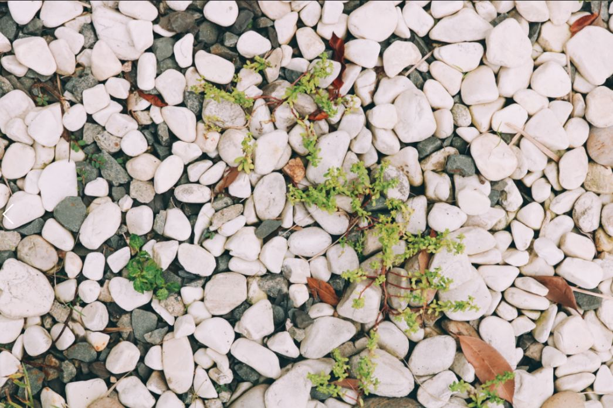
</section><section class="Powered-by-XIUMI V5" style="box-sizing: border-box;" powered-by="xiumi.us"><section class="" style="box-sizing: border-box;"><section class="" style="font-size: 12px;color: rgb(160, 160, 160);box-sizing: border-box;">
（鹅卵石地面） 

“咦地上这是……啊！凹叶景天⊙∀⊙”【掏出小本本记下来】
</section></section></section><section class="Powered-by-XIUMI V5" style="box-sizing: border-box;" powered-by="xiumi.us"><section class="" style="text-align: center;margin-top: 10px;margin-bottom: 10px;box-sizing: border-box;"><section class="" style="max-width: 100%;vertical-align: middle;display: inline-block;overflow: hidden !important;box-sizing: border-box;"></section></section>
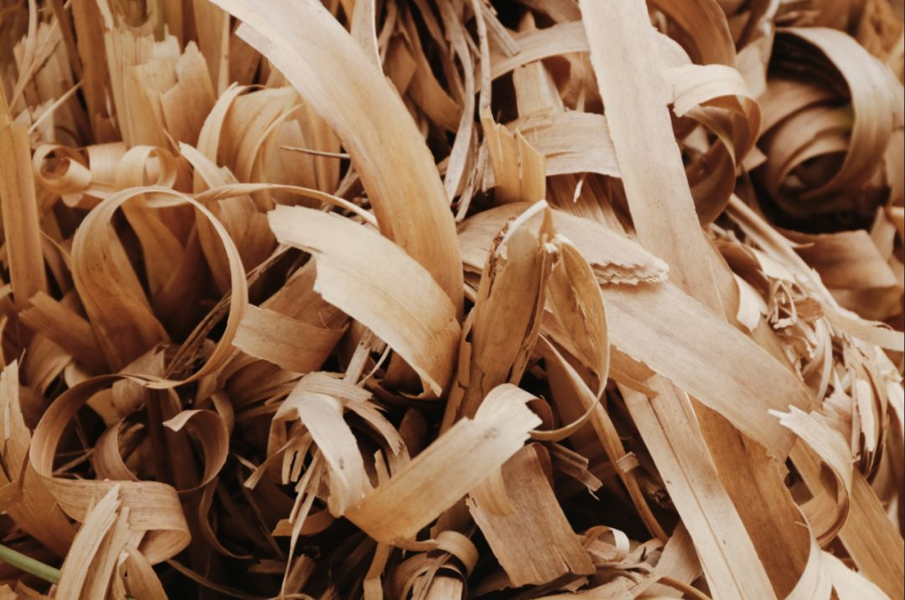
</section><section class="Powered-by-XIUMI V5" style="box-sizing: border-box;" powered-by="xiumi.us"><section class="" style="box-sizing: border-box;"><section class="" style="font-size: 12px;color: rgb(160, 160, 160);box-sizing: border-box;">
（蒲苇干枯的叶）

【画下来画下来】
</section></section></section><section class="Powered-by-XIUMI V5" style="box-sizing: border-box;" powered-by="xiumi.us"><section class="" style="text-align: center;margin-top: 10px;margin-bottom: 10px;box-sizing: border-box;"><section class="" style="max-width: 100%;vertical-align: middle;display: inline-block;overflow: hidden !important;box-sizing: border-box;"></section></section>
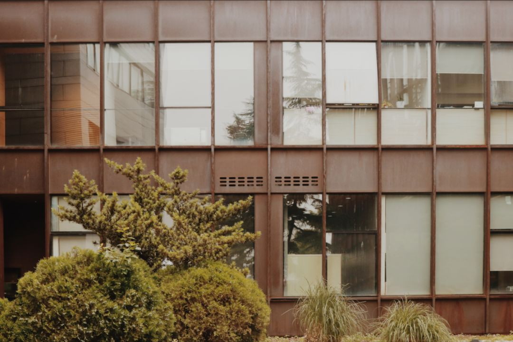
</section><section class="Powered-by-XIUMI V5" style="box-sizing: border-box;" powered-by="xiumi.us"><section class="" style="box-sizing: border-box;"><section class="" style="color: rgb(160, 160, 160);font-size: 12px;box-sizing: border-box;">
（建筑的表面）

“画面中入镜的这是……一棵罗汉松，两个黄杨球，和两丛蒲苇。唔，记下来）
</section></section></section><section class="Powered-by-XIUMI V5" style="box-sizing: border-box;" powered-by="xiumi.us"><section class="" style="margin-top: 10px;margin-bottom: 10px;box-sizing: border-box;"><section class="" style="display: inline-block;width: 100%;border-width: 1px;border-style: solid;border-color: rgb(226, 226, 226);padding: 10px;box-shadow: rgb(226, 226, 226) 0px 16px 1px -13px;box-sizing: border-box;"><section class="Powered-by-XIUMI V5" style="box-sizing: border-box;" powered-by="xiumi.us"><section class="" style="box-sizing: border-box;"><section class="" style="box-sizing: border-box;">
其靠东一侧的空隙（图中Y8的位置），则是一个人迹罕至的草坪。喜欢独来独往的小可爱们，一定会喜欢这里的⊙∀⊙！

（emmm这算不算暴露了一个秘密基地……嗨呀反正我以后会把所有的基地都曝光的2333）

 

“我是不是看到了……前面有一对……emmm……”

“！！我偏要写-.-#”
</section></section></section></section></section></section><section class="Powered-by-XIUMI V5" style="box-sizing: border-box;" powered-by="xiumi.us"><section class="" style="text-align: center;margin-top: 10px;margin-bottom: 10px;box-sizing: border-box;"><section class="" style="max-width: 100%;vertical-align: middle;display: inline-block;overflow: hidden !important;box-sizing: border-box;">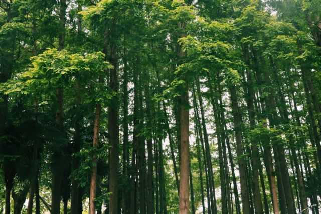</section></section></section><section class="Powered-by-XIUMI V5" style="box-sizing: border-box;" powered-by="xiumi.us"><section class="" style="box-sizing: border-box;"><section class="" style="font-size: 12px;color: rgb(160, 160, 160);box-sizing: border-box;">
“哇水杉！我要画在……”

“等等……”

“一二三四五六……

……九十一，九十二，九十三……妈耶后面混进了一棵棕榈orz”

“……”

“啊啊啊啊啊啊啊啊！”

“一，二，三……-_- #”
</section></section></section><section class="Powered-by-XIUMI V5" style="box-sizing: border-box;" powered-by="xiumi.us"><section class="" style="margin-top: 10px;margin-bottom: 10px;box-sizing: border-box;"><section class="" style="display: inline-block;width: 100%;border-width: 1px;border-style: solid;border-color: rgb(226, 226, 226);padding: 10px;box-shadow: rgb(226, 226, 226) 0px 16px 1px -13px;box-sizing: border-box;"><section class="Powered-by-XIUMI V5" style="box-sizing: border-box;" powered-by="xiumi.us"><section class="" style="box-sizing: border-box;"><section class="" style="box-sizing: border-box;">
西侧是一小块水杉林。地面被一丛丛的关节酢浆草铺得满满的，几乎看不到土地的颜色。

 

提问：西北一楼周围有多少棵水杉QAQ？
</section></section></section></section></section></section><section class="Powered-by-XIUMI V5" style="box-sizing: border-box;" powered-by="xiumi.us"><section class="" style="text-align: center;margin-top: 10px;margin-bottom: 10px;box-sizing: border-box;"><section class="" style="max-width: 100%;vertical-align: middle;display: inline-block;box-shadow: rgb(0, 0, 0) 0px 0px 0px;overflow: hidden !important;box-sizing: border-box;"></section></section>

</section><section class="Powered-by-XIUMI V5" style="box-sizing: border-box;" powered-by="xiumi.us"><section class="" style="box-sizing: border-box;"><section class="" style="font-size: 12px;color: rgb(160, 160, 160);box-sizing: border-box;">
“一百零四，一百零五，一百零六……” 

“终于全都标完了！”
</section></section></section><section class="Powered-by-XIUMI V5" style="box-sizing: border-box;" powered-by="xiumi.us"><section class="" style="margin-top: 10px;margin-bottom: 10px;box-sizing: border-box;"><section class="" style="display: inline-block;width: 100%;border-width: 1px;border-style: solid;border-color: rgb(226, 226, 226);padding: 10px;box-shadow: rgb(226, 226, 226) 0px 16px 1px;box-sizing: border-box;"><section class="Powered-by-XIUMI V5" style="box-sizing: border-box;" powered-by="xiumi.us"><section class="" style="box-sizing: border-box;"><section class="" style="font-size: 14px;box-sizing: border-box;">
建筑物中间有个水池，曾经栽种过红睡莲和白睡莲，或许某日路过，就会忽然看它钻出一朵花来。
</section></section></section><section class="Powered-by-XIUMI V5" style="box-sizing: border-box;" powered-by="xiumi.us"><section class="" style="text-align: center;margin-top: 10px;margin-bottom: 10px;box-sizing: border-box;"><section class="" style="max-width: 100%;vertical-align: middle;display: inline-block;overflow: hidden !important;box-sizing: border-box;">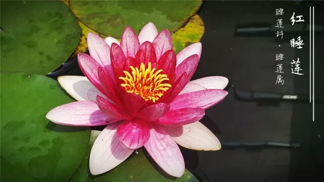</section></section></section></section></section></section><section class="Powered-by-XIUMI V5" style="box-sizing: border-box;" powered-by="xiumi.us"><section class="" style="box-sizing: border-box;"><section class="" style="box-sizing: border-box;">
 
</section></section></section><section class="Powered-by-XIUMI V5" style="box-sizing: border-box;" powered-by="xiumi.us"><section class="" style="box-sizing: border-box;"><section class="" style="font-size: 12px;color: rgb(160, 160, 160);box-sizing: border-box;">
“其实莲和睡莲之间的亲缘关系，比莲和西番莲还远呢！” 

“啊啊啊我在想什么！快动笔快动笔……”

 
</section></section></section><section class="Powered-by-XIUMI V5" style="box-sizing: border-box;" powered-by="xiumi.us"><section class="" style="margin-top: 10px;margin-bottom: 10px;box-sizing: border-box;"><section class="" style="display: inline-block;width: 100%;border-width: 1px;border-style: solid;border-color: rgb(226, 226, 226);padding: 10px;box-shadow: rgb(226, 226, 226) 0px 16px 1px;box-sizing: border-box;"><section class="Powered-by-XIUMI V5" style="box-sizing: border-box;" powered-by="xiumi.us"><section class="" style="box-sizing: border-box;"><section class="" style="font-size: 14px;box-sizing: border-box;">
地图北部为旭日楼，亦即校友之家，楼旁有桌椅，竹林和灌木丛环绕其左右。单瓣白木香、合欢和酸枣，就种在这个区域。另外，此处还有白蟾、厚萼凌霄等花卉。近来又移栽了一些花叶杞柳。 
</section></section></section></section></section></section><section class="Powered-by-XIUMI V5" style="box-sizing: border-box;" powered-by="xiumi.us"><section class="" style="text-align: center;margin-top: 10px;margin-bottom: 10px;box-sizing: border-box;"><section class="" style="max-width: 100%;vertical-align: middle;display: inline-block;box-shadow: rgb(0, 0, 0) 0px 0px 0px;overflow: hidden !important;box-sizing: border-box;"></section></section>
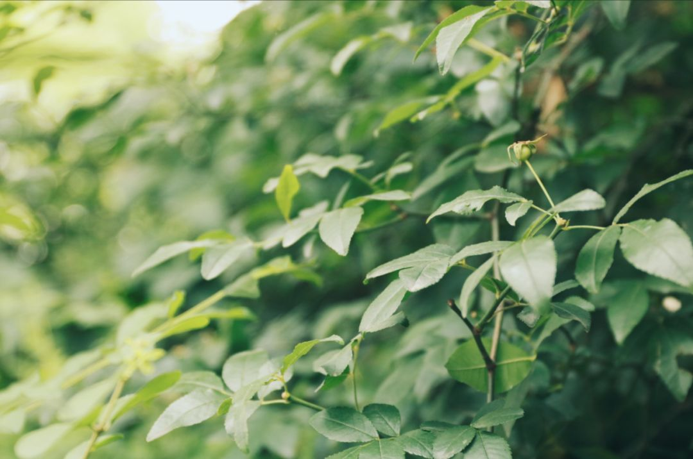
</section><section class="Powered-by-XIUMI V5" style="box-sizing: border-box;" powered-by="xiumi.us"><section class="" style="box-sizing: border-box;"><section class="" style="font-size: 12px;color: rgb(160, 160, 160);box-sizing: border-box;">
（图为尚未开放的单瓣白木香）

“去旭日楼里喝杯咖啡吧。”

【低头看了看手上厚厚的图纸】“……不行！我要继续去画逸夫楼！”

。

。

。

。

。

。

"六月太热了，我才不想那时候出门呢！”
</section></section></section><section class="Powered-by-XIUMI V5" style="box-sizing: border-box;" powered-by="xiumi.us"><section class="" style="box-sizing: border-box;"><section class="" style="box-sizing: border-box;">

 
</section></section></section><section class="Powered-by-XIUMI V5" style="box-sizing: border-box;" powered-by="xiumi.us"><section class="" style="margin-top: 10px;margin-bottom: 10px;text-align: center;box-sizing: border-box;"><section class="" style="display: inline-block;box-sizing: border-box;"><section style="display: inline-block;vertical-align: bottom;width: 0.5em;height: 0.5em;border-radius: 50%;background-color: rgb(71, 193, 168);box-sizing: border-box;"></section><section class="" style="display: inline-block;vertical-align: bottom;border-bottom: 1px dashed rgb(175, 175, 175);margin-bottom: 0.25em;padding-left: 5px;padding-right: 5px;font-size: 14px;box-sizing: border-box;">
附录：每个序号所代表的植物
</section></section></section></section><section class="Powered-by-XIUMI V5" style="box-sizing: border-box;" powered-by="xiumi.us">
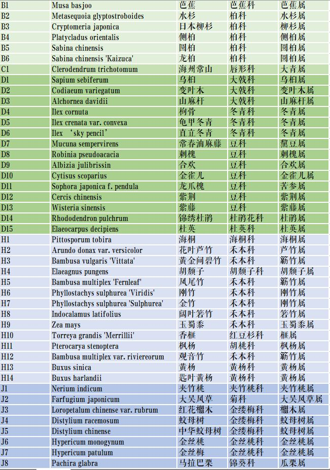
</section><section class="Powered-by-XIUMI V5" style="box-sizing: border-box;" powered-by="xiumi.us">
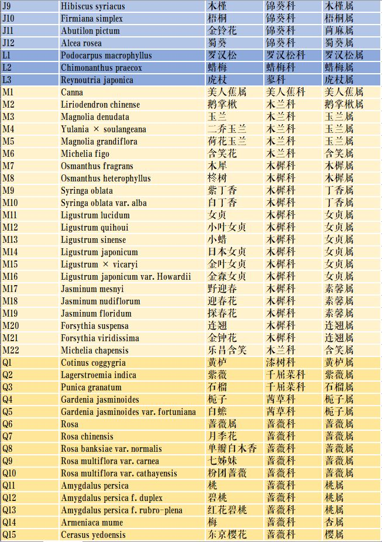
</section><section class="Powered-by-XIUMI V5" style="box-sizing: border-box;" powered-by="xiumi.us">
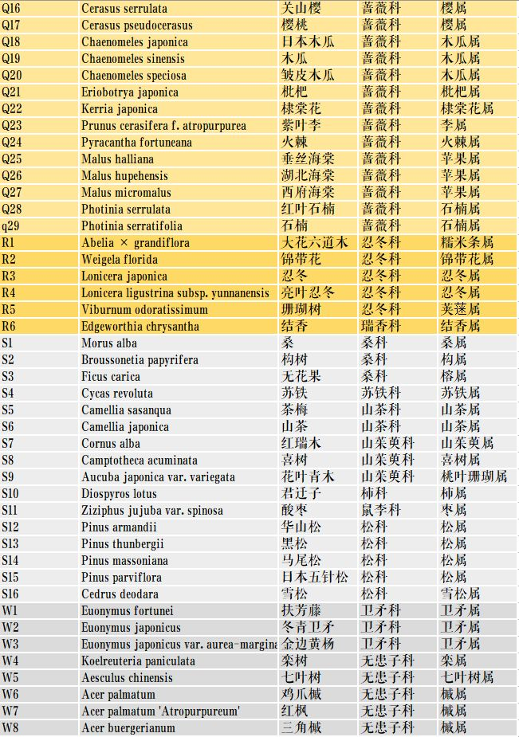
</section><section class="Powered-by-XIUMI V5" style="box-sizing: border-box;" powered-by="xiumi.us">
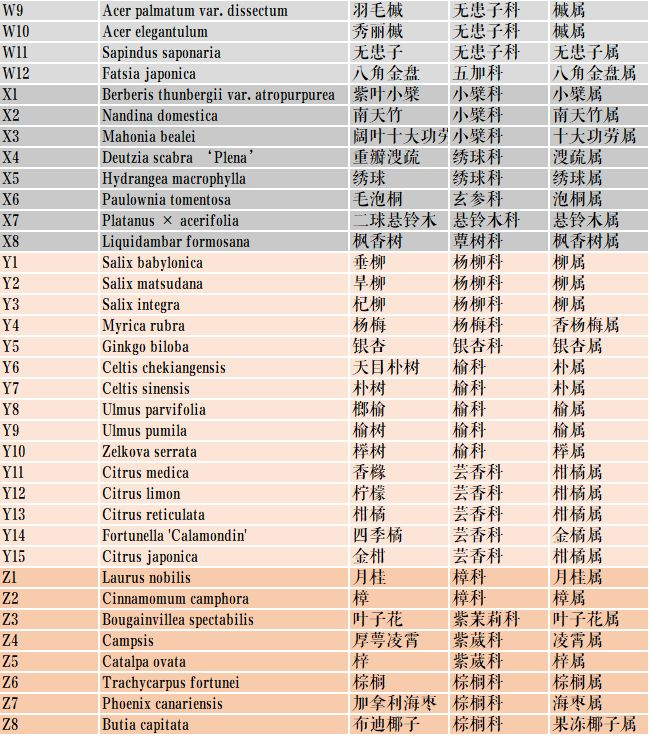
<section class="" style="text-align: center;margin-top: 10px;margin-bottom: 10px;box-sizing: border-box;"><section class="" style="max-width: 100%;vertical-align: middle;display: inline-block;overflow: hidden !important;box-sizing: border-box;"></section> </section></section><section class="Powered-by-XIUMI V5" style="box-sizing: border-box;" powered-by="xiumi.us"><section class="" style="box-sizing: border-box;"><section class="" style="font-size: 12px;color: rgb(160, 160, 160);box-sizing: border-box;">
（字母表示每种植物所在科的拼音首字母，数字没有确切的含义哦，只是依次往后排列。）
</section></section></section><section class="Powered-by-XIUMI V5" style="box-sizing: border-box;" powered-by="xiumi.us"><section class="" style="text-align: center;margin-top: 10px;margin-bottom: 10px;box-sizing: border-box;"><section class="" style="max-width: 100%;vertical-align: middle;display: inline-block;box-shadow: rgb(0, 0, 0) 0px 0px 0px;overflow: hidden !important;box-sizing: border-box;"></section></section></section><section class="Powered-by-XIUMI V5" style="box-sizing: border-box;" powered-by="xiumi.us"><section class="" style="box-sizing: border-box;"><section class="" style="font-size: 14px;color: rgb(0, 0, 0);text-align: right;box-sizing: border-box;">
同济大学校园植物资源网项目组

欢迎关注~
</section></section></section></section>

[查看原文](https://mp.weixin.qq.com/s/0wbqRQMZ-It4-mMKfhum8A)
