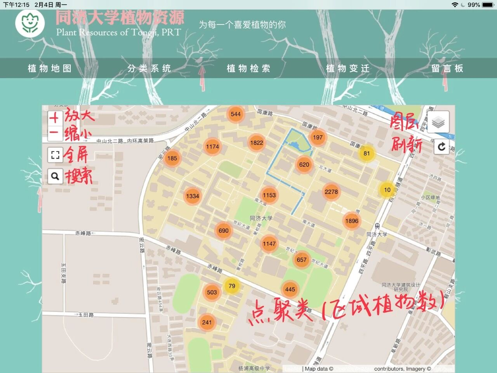
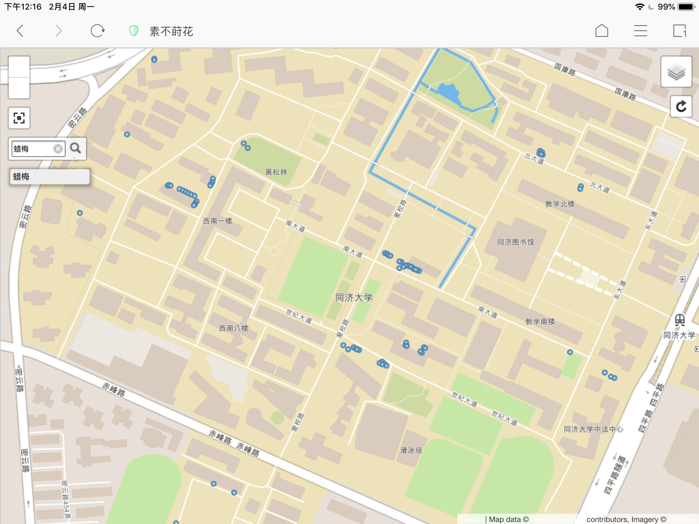
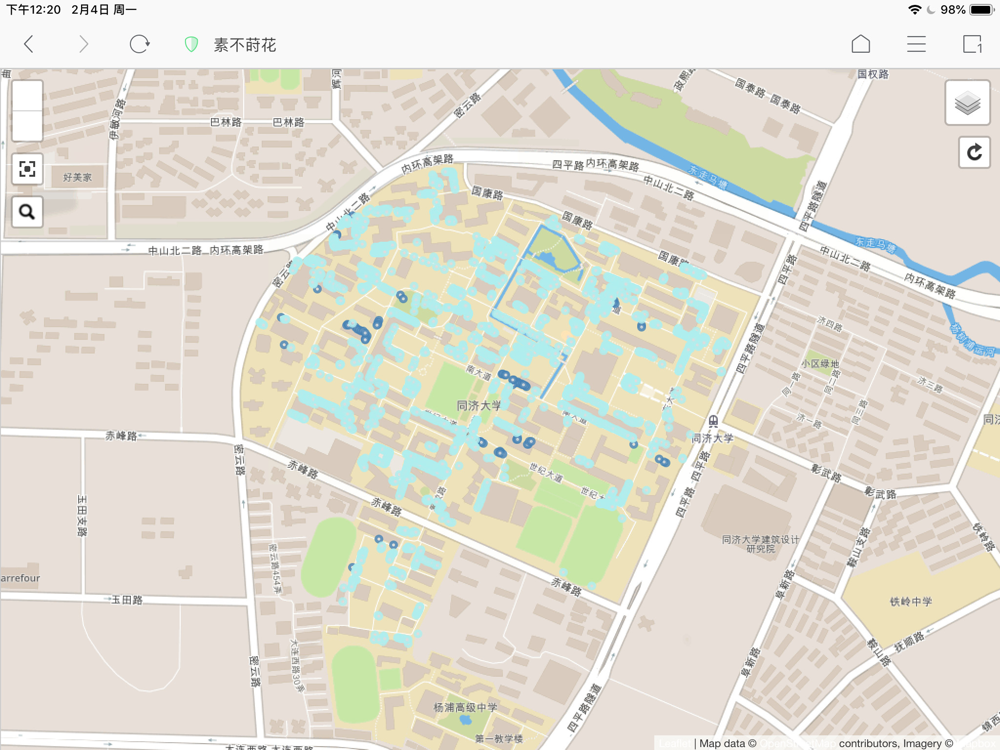
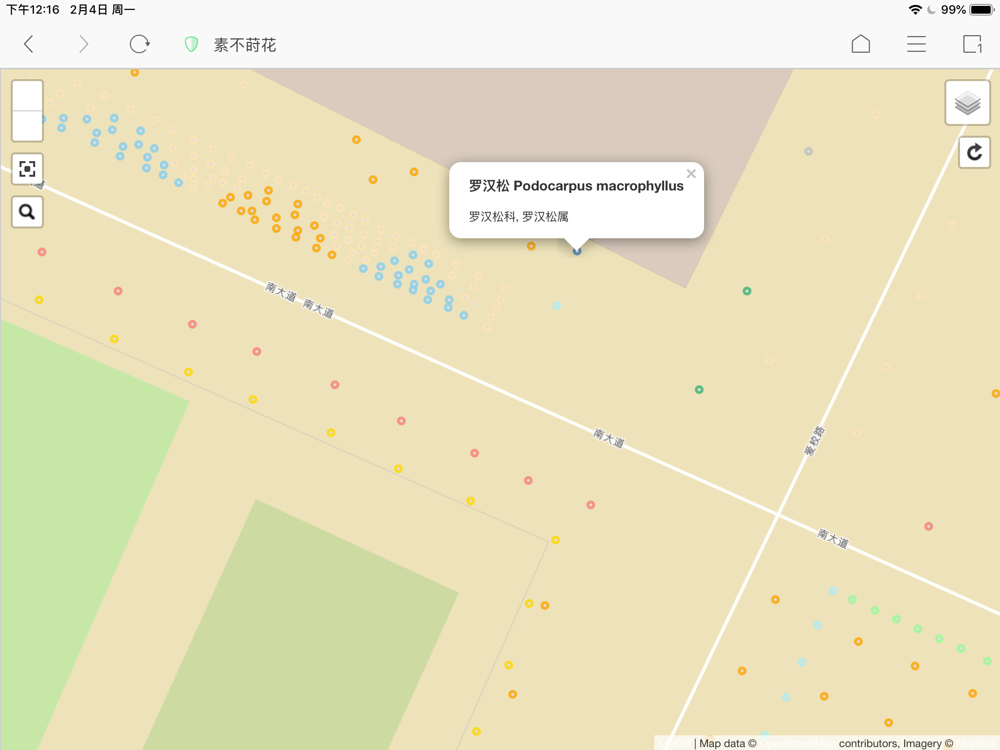
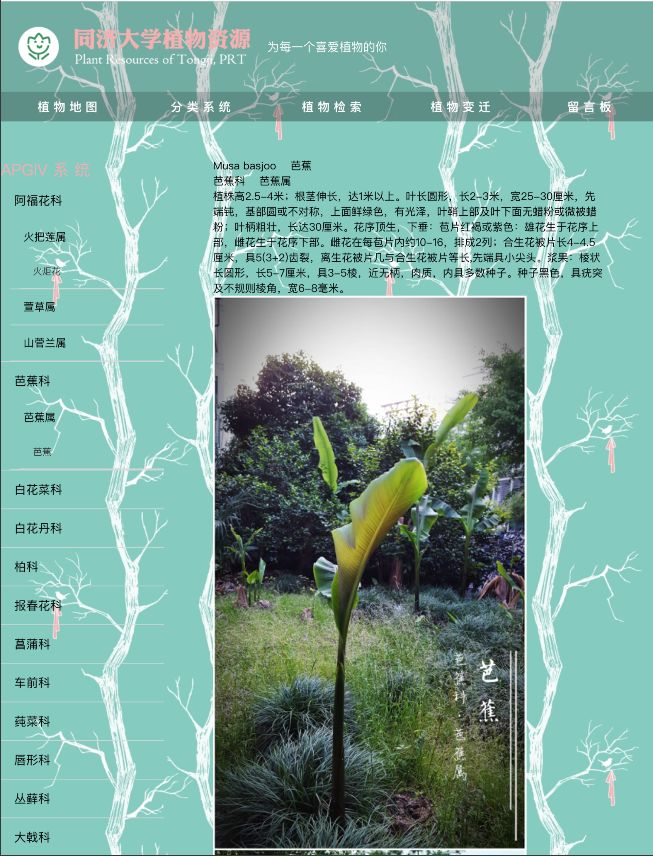
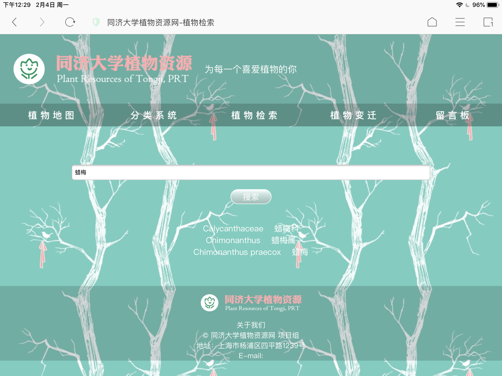
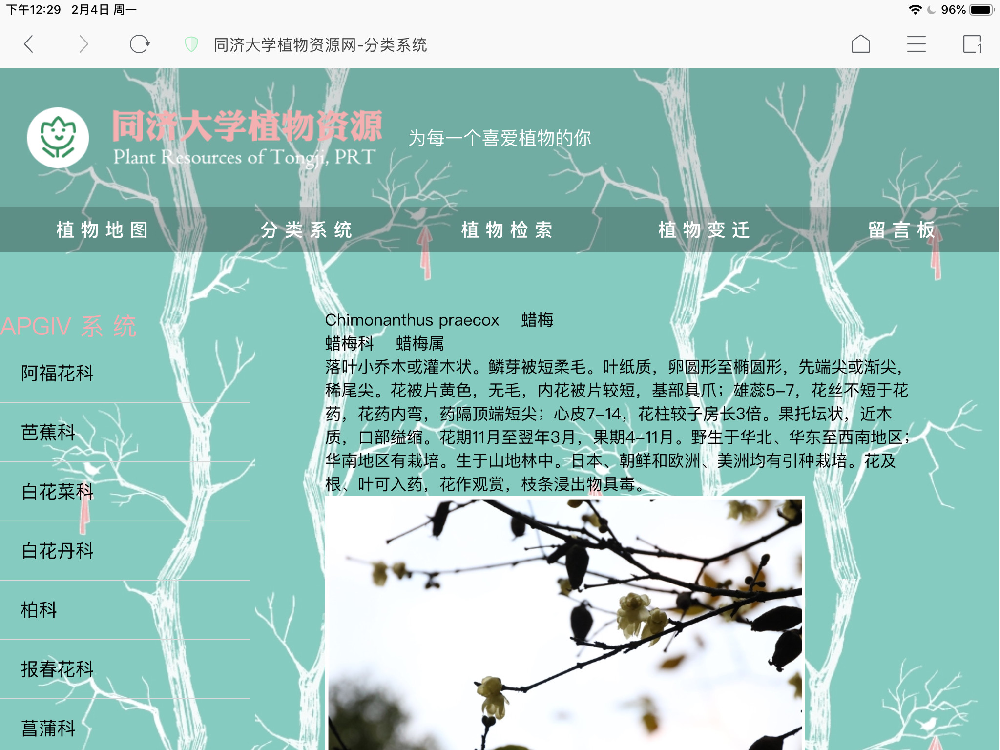

# 献给阿济的新年礼物

感谢各位小可爱的不催更之恩……）

 

植物网目前还存在一些小bug，地图也剩下三好坞这一块。但是，我们还是希望让植物网站在除夕夜提前和大家见面呢。

 

 

那先来介绍一下吧⊙∀⊙！

网站名称地址和主页如下：

（请记住它！！！↓）

素不莳花 www.tongjiplants.com

共分为五个板块。

 

在“植物地图”板块的电子地图中搜索“蜡梅”，可以查询它在校园中的准确位置。目前可以搜索的有乔木灌木（详情参考<a href="http://mp.weixin.qq.com/s?__biz=MzI1MTIzMTAzOA==&amp;mid=2247483727&amp;idx=1&amp;sn=d9dbb65a131ee17cdfabd180ba90556a&amp;chksm=e9f76f1ede80e6086327107ae48235bdc17d349be75b117b5a857a7c5a815fcba038fc04ac19&amp;scene=21#wechat_redirect" target="_blank" data-linktype="2">地图纪｜预告篇：植物调绘的日常</a>中所列举的植物名单），花花草草是搜不到的！ 

（emmm比如“沿阶草”、“大吴风草”都是无法搜索的）

哪怕是分布再广的黄杨，也都能查得到！

（校园中的666棵超过两米高的樟树，2044棵水杉，699棵棕榈，409棵二球悬铃木，290棵垂丝海棠，都是我们一棵棵数出来画上去的呀）

（我们记得住所有小可爱的位置(๑•̀_•́๑)✧）

 

还可以直接放大单击查询某区域的植物 

（不同种类用不同颜色区分出来辣）

 

在“分类系统”板块，可以查看校园植物的图片文字信息。 

（以APGIV系统的科为划分标准）

 

在“植物检索”板块，可以输入植物的名称来进行对图片、描述的查询。

下方的白字是查询结果

植物变迁和留言板还在继续完善中。

hhh虽然它还是个孩子，但是会越长越大的！地图中的标注有个别错误，我们正在进行校对并纠正！

 

另：地图中的龙柏&amp;圆柏，垂丝海棠&amp;西府海棠&amp;湖北海棠，榆树&amp;榔榆以及柑橘属的不同种之间，可能会有误判，请有需要的小可爱们实地考察一下。这方面我们也在逐渐修正排查！ 

 

（鞠躬） 

 

祝小可爱们新年快乐鸭！

 

 

还有还有……嘉定的小可爱们，要等着我们呀！
<section class="" style="box-sizing: border-box;"><section class="" style="box-sizing: border-box;"><section class="" style="font-size: 14px;color: rgb(0, 0, 0);text-align: right;box-sizing: border-box;">

同济大学校园植物资源网项目组 

欢迎关注~

 
</section></section></section>
↙点击阅读原文，就可以直接访问网站啦

&nbsp;&nbsp;&nbsp; （推荐使用电脑访问） 

[查看原文](https://mp.weixin.qq.com/s/FtSSJAmCEzijm79zbtnKyQ)
