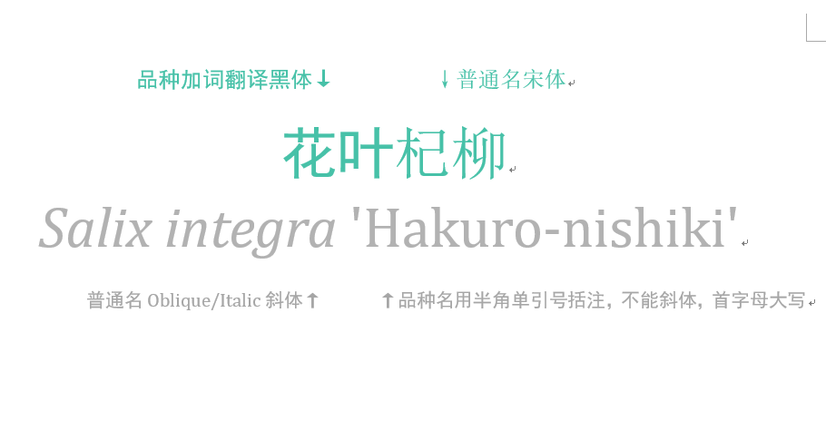

# 花名册 | 植物学名及中文正名的书写规范

<section class="Powered-by-XIUMI V5" powered-by="xiumi.us" style="white-space: normal;box-sizing: border-box;"><section class="" style="margin-top: 10px;margin-bottom: 10px;font-size: 11px;box-sizing: border-box;">/*注：本文整理于姚燊豪老师的《植物名称的正确书写和规范》及汪远老师的《植物学名书写规范及中文名使用原则》*/ </section><section class="" style="margin-top: 10px;margin-bottom: 10px;font-size: 11px;box-sizing: border-box;">全文大概九千字，感兴趣的同学请慢慢看（别忘了掏出小本记笔记）</section><section class="" style="margin-top: 10px;margin-bottom: 10px;font-size: 11px;box-sizing: border-box;">原文链接及相关资料在文末。（也可以直接拉过去下载）</section><section class="" style="margin-top: 10px;margin-bottom: 10px;font-size: 11px;box-sizing: border-box;"></section>
<section class="" style="margin-top: 10px;margin-bottom: 10px;font-size: 11px;box-sizing: border-box;">Word编辑的题图给你们给你们 ↓ </section><section class="" style="margin-top: 10px;margin-bottom: 10px;font-size: 11px;box-sizing: border-box;"></section>

前方全程高能

！

！

！

<section class="" style="margin-top: 10px;margin-bottom: 10px;font-size: 11px;box-sizing: border-box;"></section></section><section class="Powered-by-XIUMI V5" powered-by="xiumi.us" style="white-space: normal;box-sizing: border-box;"><section class="" style="margin-top: 10px;margin-bottom: 10px;text-align: center;font-size: 11px;box-sizing: border-box;"><section class="" style="padding-bottom: 1.3em;display: inline-block;vertical-align: top;box-sizing: border-box;"><section class="" style="margin: auto;border-radius: 100%;background-color: rgb(71, 193, 168);width: 2em;height: 2em;border-style: solid;border-width: 2px;font-size: 20px;line-height: 1.8em;color: rgb(255, 255, 255);box-sizing: border-box;">01</section><section style="margin-top: -2.3em;margin-right: auto;margin-left: auto;width: 3.6em;transform: rotate(-45deg);transform-origin: right top 0px;border-top: 1px solid rgb(0, 0, 0);box-sizing: border-box;"><section style="margin: auto;width: 0px;border-top: 1.5em solid rgb(255, 255, 255);border-left: 1.5em solid transparent;border-right: 1.5em solid transparent;box-sizing: border-box;"> </section></section></section></section></section>
植物学名的命名规范应遵循《国际藻类、真菌及植物命名法规》。栽培植物应遵循《国际栽培植物命名法规》。 

<section class="Powered-by-XIUMI V5" powered-by="xiumi.us" style="white-space: normal;box-sizing: border-box;"><section class="" style="margin-top: 10px;margin-bottom: 10px;text-align: center;font-size: 11px;box-sizing: border-box;"><section class="" style="padding-bottom: 1.3em;display: inline-block;vertical-align: top;box-sizing: border-box;"><section class="" style="margin: auto;border-radius: 100%;background-color: rgb(71, 193, 168);width: 2em;height: 2em;border-style: solid;border-width: 2px;font-size: 20px;line-height: 1.8em;color: rgb(255, 255, 255);box-sizing: border-box;">02</section><section style="margin-top: -2.3em;margin-right: auto;margin-left: auto;width: 3.6em;transform: rotate(-45deg);transform-origin: right top 0px;border-top: 1px solid rgb(0, 0, 0);box-sizing: border-box;"><section style="margin: auto;width: 0px;border-top: 1.5em solid rgb(255, 255, 255);border-left: 1.5em solid transparent;border-right: 1.5em solid transparent;box-sizing: border-box;"> </section></section></section></section></section>
植物学名的<strong>基本等级</strong>为：
<blockquote style="white-space: normal;">
种（species，sp.）

亚种（subspecies，subsp.）

变种（variety，var.）

变型（form，f.）

杂交种（ × ）
</blockquote>

<section class="Powered-by-XIUMI V5" powered-by="xiumi.us" style="white-space: normal;box-sizing: border-box;"><section class="" style="margin-top: 10px;margin-bottom: 10px;text-align: center;font-size: 11px;box-sizing: border-box;"><section class="" style="padding-bottom: 1.3em;display: inline-block;vertical-align: top;box-sizing: border-box;"><section class="" style="margin: auto;border-radius: 100%;background-color: rgb(71, 193, 168);width: 2em;height: 2em;border-style: solid;border-width: 2px;font-size: 20px;line-height: 1.8em;color: rgb(255, 255, 255);box-sizing: border-box;">03</section><section style="margin-top: -2.3em;margin-right: auto;margin-left: auto;width: 3.6em;transform: rotate(-45deg);transform-origin: right top 0px;border-top: 1px solid rgb(0, 0, 0);box-sizing: border-box;"><section style="margin: auto;width: 0px;border-top: 1.5em solid rgb(255, 255, 255);border-left: 1.5em solid transparent;border-right: 1.5em solid transparent;box-sizing: border-box;"> </section></section></section></section></section>
&nbsp;植物种以上的主要等级包括： 
<blockquote style="white-space: normal;">
门（Phylum）

纲（Class）

目（Order）

科（family）

属（genus）
</blockquote>
其中<strong>目、科、属为最常用的等级</strong>。科和种之间的次常用等级，包括
<blockquote style="white-space: normal;">
亚科（subfamily）

族（tribe）

亚族（subtribe）

亚属（subgenus）

组（section，sect.）

亚组（subsection，subsect.）

系（series，ser.）

亚系（subseries，subser.）
</blockquote>
等。

一些旧的书上还会使用群（grex）和亚群（subgrex）的等级，现在已限制<strong>仅用于兰科植物的杂交群中</strong>。

<strong>属以上等级及属下种上书写不斜体</strong>。如：
<blockquote style="white-space: normal;">
向日葵族Tribe&nbsp;Heliantheae

飞廉亚族Subtribe Carduinae

山茶亚属Subgen.&nbsp;<em>Camellia</em>

钩距黄堇组Sect. Hamatae

高山杜鹃亚组Subsect. Lapponica

曲花紫堇系Ser. Curviflorae

蔓榕亚系Subser. Podosyceae

马先蒿群Grex Pedicularis

之形花亚群Subgrex&nbsp;Sigmantha
</blockquote>
注意：当植物志里已异名引证形式出现时，属下种上等级的名称要斜体，但正条目本身的名称不需要斜体。

<section class="Powered-by-XIUMI V5" powered-by="xiumi.us" style="white-space: normal;box-sizing: border-box;"><section class="" style="margin-top: 10px;margin-bottom: 10px;text-align: center;font-size: 11px;box-sizing: border-box;"><section class="" style="padding-bottom: 1.3em;display: inline-block;vertical-align: top;box-sizing: border-box;"><section class="" style="margin: auto;border-radius: 100%;background-color: rgb(71, 193, 168);width: 2em;height: 2em;border-style: solid;border-width: 2px;font-size: 20px;line-height: 1.8em;color: rgb(255, 255, 255);box-sizing: border-box;">04</section><section style="margin-top: -2.3em;margin-right: auto;margin-left: auto;width: 3.6em;transform: rotate(-45deg);transform-origin: right top 0px;border-top: 1px solid rgb(0, 0, 0);box-sizing: border-box;"><section style="margin: auto;width: 0px;border-top: 1.5em solid rgb(255, 255, 255);border-left: 1.5em solid transparent;border-right: 1.5em solid transparent;box-sizing: border-box;"> </section></section></section></section></section>
栽培植物的名称涉及
<blockquote style="white-space: normal;">
栽培品种（cultivar，cv.）

栽培群（group）

杂交群（grex）

商品名（trade designation）

临时名
</blockquote>
等。过去亦常用品种群，现已用栽培群代替。

<section class="Powered-by-XIUMI V5" powered-by="xiumi.us" style="white-space: normal;box-sizing: border-box;"><section class="" style="margin-top: 10px;margin-bottom: 10px;text-align: center;font-size: 11px;box-sizing: border-box;"><section class="" style="padding-bottom: 1.3em;display: inline-block;vertical-align: top;box-sizing: border-box;"><section class="" style="margin: auto;border-radius: 100%;background-color: rgb(71, 193, 168);width: 2em;height: 2em;border-style: solid;border-width: 2px;font-size: 20px;line-height: 1.8em;color: rgb(255, 255, 255);box-sizing: border-box;">05</section><section style="margin-top: -2.3em;margin-right: auto;margin-left: auto;width: 3.6em;transform: rotate(-45deg);transform-origin: right top 0px;border-top: 1px solid rgb(0, 0, 0);box-sizing: border-box;"><section style="margin: auto;width: 0px;border-top: 1.5em solid rgb(255, 255, 255);border-left: 1.5em solid transparent;border-right: 1.5em solid transparent;box-sizing: border-box;"> </section></section></section></section></section>
学名基本格式：

 

<strong>种（species, sp.）</strong>

基本格式：<strong style="color: rgb(71, 193, 168);"><em>Aa bb</em></strong>

<strong>属名首字母大写，种加名不大写，两者在字典和植物志条目标题中使用黑体或者加粗外，其余多数情况均需使用斜体（oblique或者italic）</strong>。
<blockquote style="white-space: normal;">
如一般情况下的金丝桃<em>Hypericum monogynum</em>&nbsp;L.

Flora of China中作为主条目名称的雷公鹅耳枥<strong>Carpinus viminea</strong>&nbsp;Wall ex. Lindl.

作为植物字典正文主条目名称的无患子<strong>Sapindus saponaria L.</strong>
</blockquote>
<strong>非正式场合，命名人可省略不写，但正式场合必须写上命名人</strong>。<strong>命名人按照正常格式，不能斜体、粗体或者其他特殊格式</strong>；

 

 

<strong>亚种（subspecies, subsp.）</strong>

基本格式：<strong><em>Aa bb</em>&nbsp;subsp.&nbsp;<em>cc</em></strong>

<strong>亚种书写，由属名、种加词、亚种标记（subsp.）、亚种加词组成，属名首字母大写，其余字母小写；正式书写时，属名、种加词、亚种加词应斜体或粗体，亚种标记（subsp.）正常书写，亚种加词后接该学名的命名人（正常书写）。</strong>在不会产生误解的一般书写时，可省略命名人。常有将subsp.缩写为ssp.使用的，应当按标准缩写予以改正。
<blockquote style="white-space: normal;">
<em>Lespedeza thunbergii</em>&nbsp;subsp.&nbsp;<em>formosa&nbsp;</em>美丽胡枝子

<em>Olea europaea</em>&nbsp;subsp.&nbsp;<em>cuspidata</em>&nbsp;尖叶木犀榄

<em>Syringa reticulata</em>&nbsp;subsp.&nbsp;<em>amurensis</em>暴马丁香
</blockquote>
 

 

<strong>变种（variety, var.）</strong>

基本格式：<strong><em>Aa bb</em>&nbsp;var.&nbsp;<em>cc</em></strong>

<strong>变种书写格式与亚种相同，变种标记为var.</strong>。

<blockquote style="white-space: normal;">
<em>Idesia polycarpa</em>&nbsp;var.&nbsp;<em>vestita</em>&nbsp;毛叶山桐子

<em>Grewia biloba</em>&nbsp;var.&nbsp;<em>parviflora</em>&nbsp;小花扁担杆

<em>Gasteria carinata</em>&nbsp;var.&nbsp;<em>verrucosa</em>&nbsp;沙鱼掌
</blockquote>
 

 

<strong>变型（form, f.）</strong>

基本格式：<strong><em>Aa bb</em>&nbsp;f.&nbsp;<em>cc</em></strong>

<strong>变型书写格式与亚种相同。变型标记为f.</strong>。

f.有时写为forma、form、fo.，都应按标准缩写予以改正。

<blockquote style="white-space: normal;">
<em>Cyrtomium caryotideum</em>&nbsp;f.&nbsp;<em>grossedentatum</em>&nbsp;粗齿贯众

<em>Viburnum plicatum</em>&nbsp;f.&nbsp;<em>tomentosum</em>&nbsp;蝴蝶戏珠花

<em>Ziziphus jujuba</em>&nbsp;f.&nbsp;<em>lageniformis</em>&nbsp;葫芦枣
</blockquote>
 

 

<strong>杂交种（hybrid species, ×）</strong>

基本格式：<strong><em>Aa</em>&nbsp;×&nbsp;<em>bc</em></strong><em>&nbsp;</em>=&nbsp;<em style="font-size: 14px;">Aa bb</em>&nbsp;×&nbsp;<em style="font-size: 14px;">cc</em>&nbsp;=&nbsp;<em style="font-size: 14px;">Aa bb</em>&nbsp;×&nbsp;<em style="font-size: 14px;">Aa cc</em>

<strong><em>Aa</em>&nbsp;×&nbsp;<em>bd</em></strong><em>&nbsp;</em>=&nbsp;<em style="font-size: 14px;">Aa</em>&nbsp;(<em style="font-size: 14px;">bb</em>&nbsp;×&nbsp;<em style="font-size: 14px;">cc</em>) ×&nbsp;<em style="font-size: 14px;">dd</em>&nbsp;= (<em style="font-size: 14px;">Aa bb</em>&nbsp;×&nbsp;<em style="font-size: 14px;">Aa cc</em>) ×&nbsp;<em style="font-size: 14px;">Aa dd</em>

<strong>×<em>Ab cd&nbsp;</em></strong>=&nbsp;<em style="font-size: 14px;">Aa cc</em>&nbsp;×&nbsp;<em style="font-size: 14px;">Bb dd</em>

杂交种是由<strong>两种植物有性结合</strong>形成，有<strong>属内杂交种</strong>及<strong>属间杂交种</strong>。

<strong>属内杂交种最基本的书写格式是<em>Aa</em>&nbsp;×&nbsp;<em>bc</em>，Aa、bc斜体或粗体，杂交符号“×”正常书写</strong>。这是由<em>Aa</em>属内的两个种<em>Aa bb</em>和<em>Aa cc</em>杂交而来，种加词<em>bc</em>可以是新拟，也可以从<em>bb</em>、<em>cc</em>中各取一部分而成。当没有为杂交种拟定新的名称时，也可写为<em>Aa bb</em>&nbsp;×&nbsp;<em>cc</em>。

<strong>若杂交亲本自身也是杂交种时，可以使用类似于数学公式的杂交公式来表示</strong>。一般来说，一个正式发表的复杂杂交种，应当新拟一个类似于<em>Aa</em>&nbsp;×&nbsp;<em>bd</em>的学名或者类似<em>Aa</em>&nbsp;'Bd'的品种名，以利于传播和使用；但当为了表明其亲本时，也可使用类似于<em>Aa</em>&nbsp;(<em>bb</em>&nbsp;×&nbsp;<em>cc</em>) ×&nbsp;<em>dd</em>的形式表示。

<strong>属间杂交种最基本的书写格式是×<em>Ab cd</em>，杂交符号写在属名之前，属名与种加词之间没有杂交符号</strong>。杂交属名一般由母本、父本属名各取一部分组合而成。同样的亲本杂交后代可以形成不同的杂交品种。

无论是属内或属间杂交种，如果是人工培育或选育，一般可直接命名为品种，如<em>Aa</em>&nbsp;'Bb'或×<em>Ab</em>&nbsp;'Cc'这样的形式。
<blockquote style="white-space: normal;">
<em>Aloe</em>&nbsp;×&nbsp;<em>delaetii&nbsp;</em>=<em>&nbsp;Aloe ciliaris</em>&nbsp;×&nbsp;<em>succotrina</em>&nbsp;海虎兰

<em>Euphorbia</em>&nbsp;'Sunrise'&nbsp;=&nbsp;<em>Euphorbia pseudocactus</em>&nbsp;×&nbsp;<em>bougheyi</em>&nbsp;'Sunrise'&nbsp;<strong>日出</strong>杂交大戟

×<em>Cuprocyparis leylandii&nbsp;</em>=&nbsp;<em>Cupressus macrocarpa</em>&nbsp;×&nbsp;<em>Xanthocyparis nootkatensis</em>&nbsp;莱兰柏

×<em>Chitalpa tashkentensis</em>&nbsp;=&nbsp;<em>Catalpa bignonioides</em>&nbsp;×&nbsp;<em>Chilopsis linearis</em>&nbsp;塔什干梓

<em>Aechmea chantinii</em>&nbsp;×&nbsp;<em>Hohenbergia stellata</em>&nbsp;斑马凤梨×星光球花凤梨
</blockquote>
注意有些杂交种的学名不带杂交符号也被广泛使用，但种加名里往往带有hortorum、cultorum或者hybrida/-um/-us等名称，这些种严格上应加上杂交符号，但并不常用，如：
<blockquote style="white-space: normal;">
天竺葵<em>Pelargonium hortorum</em>&nbsp;L.H.Bailey

大岩桐<em>Sinningia hybrida&nbsp;</em>Voss

瓜叶菊<em>Pericallis hybrida</em>&nbsp;B.Nord.

西洋杜鹃<em>Rhododendron hybridum&nbsp;</em>Ker Gawl.
</blockquote>
 

兰花常涉及多个属间的杂交，如
<blockquote style="white-space: normal;">
×&nbsp;<em>Schunkeara Big Shot</em>&nbsp;'Hilo Sparkle'是×&nbsp;<em>Aliceara&nbsp;Tahoma Glacier</em>&nbsp;×&nbsp;<em>Miltonia Maui Titan</em>杂交种，其中×&nbsp;<em>Aliceara Tahoma Glacie</em>又是×&nbsp;<em>Miltassia&nbsp;</em>'Cartagena' ×<em>&nbsp;Odontioda Alaskan Sunset</em>的属间杂交，×&nbsp;<em>Miltassia</em>又是<em>Brassia&nbsp;</em>×&nbsp;<em>Miltonia</em>的杂交属，×&nbsp;<em>Odontioda Alaskan Sunset</em>又是<em>Odontioda Lautrix</em>&nbsp;×&nbsp;<em>Odontoglossum Yellowstone Basin</em>的属间杂交，×&nbsp;<em>Odontioda</em>又是<em>Odontoglossum</em>&nbsp;×&nbsp;<em>Cochlioda</em>的杂交属，因此这是一个涉及四个属的属间杂交，
</blockquote>
<strong style="text-align: justify;">属名后首字母大写的部分为兰花特定的杂交群（grex）的名称，并非属名或者品种名</strong>。

 

<strong>嫁接嵌合体（graft-chimaeras, +）</strong>

基本格式：

<strong>+<em>Ab</em>&nbsp;'Cd'</strong>&nbsp;=&nbsp;<em style="font-size: 14px;">Aa cc</em>&nbsp;+&nbsp;<em style="font-size: 14px;">Bb dd</em>

<strong><em>Aa</em>&nbsp;'Bc'</strong>&nbsp;=&nbsp;<em style="font-size: 14px;">Aa bb</em>&nbsp;+&nbsp;<em style="font-size: 14px;">Aa cc</em>

嫁接嵌合体是由两个不同种嫁接后，两亲本细胞包围嵌合生长而成，兼具两种不同植物的特征；这种植物使用“+”来表示。属间嫁接嵌合体由“+”和两个属的属名组合，以及品种加词组成；属内嫁接嵌合体直接作为品种对待。<strong>书写时，“+”正常书写，属名斜体或加粗，品种名正常书写。也可以使用嫁接嵌合体公式表示，例如<em>Aa cc</em>&nbsp;+&nbsp;<em>Bb dd、Aa bb</em>&nbsp;+&nbsp;<em>Aa cc</em></strong>。需要注意的是，同样两种植物嫁接产生的嫁接嵌合体，可能是不一样的品种。

<blockquote style="white-space: normal;">
+<em>Myrtillocalycium</em>&nbsp;'Polyp'&nbsp;

=&nbsp;<em>Myrtillocactus cochal</em>&nbsp;+&nbsp;<em>Gymnocalycium mihanovichii</em>&nbsp;'Red Hibotan'&nbsp;<strong>息肉</strong>龙神球

+<em>Citroponcirus</em>&nbsp;'Hormish'&nbsp;

=&nbsp;<em>Citrus reticulata</em>&nbsp;+&nbsp;<em>Poncirus trifoliata</em>&nbsp;<strong>霍密斯</strong>枳合芦

<em>Syringa</em>&nbsp;'Correlata'&nbsp;

=&nbsp;<em>Syringa</em>&nbsp;×&nbsp;<em>chinensis</em>&nbsp;+&nbsp;<em>Syringa vulgaris</em>&nbsp;'Correa'&nbsp;<strong>科雷亚</strong>丁香

<em>Camellia</em>&nbsp;'Daisy Eagleson'&nbsp;

=&nbsp;<em>Camellia japonica</em>&nbsp;+&nbsp;<em>Camellia sasanqua</em>&nbsp;'Maiden's Blush'&nbsp;<strong>戴西·伊格尔森</strong>山茶
</blockquote>
 

 

<strong>栽培品种（cultivar, cv.）</strong>

基本格式：

<strong><em>Aa bb</em>&nbsp;'Cc'</strong>

<strong><em style="font-size: 14px;">Aa</em>&nbsp;'Cc'</strong>

<strong>基本格式、杂交种等后面都可以接品种名。这些格式都按照标准书写，而栽培品种加词正体，需使用‘’、''或΄΄括起来，不能使用这三者之外的符号，如双引号等。</strong>不能使用cv.作为品种名等级标记。除一些复杂种间杂交种，品种名直接接在属名之后外，种下、明确的杂交种等都需将种级名称写全。栽培品种可以在英国皇家园艺学会（RHS）的园艺数据库中查询（http://apps.rhs.org.uk/horticulturaldatabase/summary2.asp），输入属名+品种名即可查询；若无法查到，可以删去一部分，只留下个别关键词进行查询。

 

当在分类学中被归并的物种，或者任何已经建立了的正确名称，无论是否被承认，如果在园艺上是有价值的，可以将原来的种加词指定为栽培群（Group）；若无必要建立栽培群，则可看作是品种，将原有加词做为品种加词。如原有一种植物<em>Aa bb</em>，经分类研究认为应当归并为<em>Aa cc</em>，则在园艺上若仍需使用该名称，应写为<em>Aa cc</em>&nbsp;'Bb'，如<em>Euonymus fortunei</em>&nbsp;'Kiautschovicus' （Syn.&nbsp;<em>Euonymus kiautschovicus</em>）。或是<em>Aa bb</em>&nbsp;f.&nbsp;<em>cc</em>不被承认，被做为品种看待时，使用<em>Aa bb</em>&nbsp;'Cc'，如<em>Punica granatum</em>&nbsp;'Pleniflora' （Syn.&nbsp;<em>Punica granatum</em>&nbsp;f.&nbsp;<em>pleniflora</em>）。
<blockquote style="white-space: normal;">
<em>Miscanthus sinensis</em>&nbsp;'Gracillimus'&nbsp;<strong>细叶</strong>芒

<em>Imperata cylindrica</em>&nbsp;'Rubra'&nbsp;血草

<em>Hemerocallis</em>&nbsp;'Piano Man'&nbsp;<strong>钢琴家</strong>萱草

<em>Euonymus fortunei</em>&nbsp;'Kiautschovicus' （Syn.&nbsp;<em>Euonymus kiautschovicus</em>）&nbsp;胶东卫矛

<em>Punica granatum</em>&nbsp;'Pleniflora' （Syn.&nbsp;<em>Punica granatum</em>&nbsp;f.&nbsp;<em>pleniflora</em>）&nbsp;<strong>重瓣红</strong>石榴
</blockquote>
 

 

<strong>栽培群（Group）、杂交群（grex, gx）</strong>

基本格式：

<strong><em>Aa bb</em>&nbsp;(Cc Group)</strong>

<strong><em>Aa</em>&nbsp;(Cc Group)</strong>

<strong><em>Aa bb</em>&nbsp;(Cc gx)</strong>

<strong><em>Aa</em>&nbsp;(Cc gx)</strong>

栽培群（旧称品种群）是具有某一类共同特征品种的分类单位一般用于品种数极多的类群，如月季、杜鹃、报春花、鸢尾等，兰花的杂交群是特殊的栽培群。可以使用括号将栽培群名称括起来，也可以省略括号。为了方便区分栽培群，这里推荐使用括号。<strong>栽培群不斜体，在名称后加“Group”一词，</strong><strong>Group首字母必须大写。兰科植物使用杂交群（特定亲本杂交群；grex, gx）作为标记</strong>。同样可以不使用括号，甚至可以省略grex、gx标记，都是符合法规的写法。但是为了突出杂交群，这里使用括号并使用gx作为标记。不可以将Group（gx）使用单引号括起来。栽培群、杂交群后面可以再接品种名，如<em>Aa bb</em>&nbsp;(Cc Group) 'Dd'。

<blockquote style="white-space: normal;">
<em>Rhododendron</em>&nbsp;(Rouge Group)&nbsp;杜鹃花 胭脂群

<em>Rhus</em>&nbsp;×&nbsp;<em>pulvinata</em>&nbsp;(Autumn Lace Group)&nbsp;软木漆 秋带群

<em>Angraecum</em>&nbsp;(Lady Lisa gx)&nbsp;武夷兰 利萨群

<em>Amitostigma</em>&nbsp;(Enomotoe gx) 'Kou Itten'&nbsp;‘科·伊顿’无柱兰 榎本群
</blockquote>
<strong>当不能确定具体的品种时，可以写成所在的品种群</strong>，如：
<blockquote style="white-space: normal;">
‘Osborne Green’报春花<em>Primula</em>&nbsp;'Osborne Green'在品种不明确的时候可以写作<em>Primula Border&nbsp;</em>Auricula Group；

<strong>朝霞</strong>丹桂在具体品种不明确的情况下写作<em>Osmanthus fragrans</em>&nbsp;Aurantiacus Group，即丹桂群；

<strong>小红帽</strong>现代月季可以写作Rosa hybrida Floribunda&nbsp;Group，即丰花月季群；

红网纹草Fittonia albivenis Verschaffeltii Group。
</blockquote>
 

 

<strong>商业指称（trade designations，商品名）</strong>

基本格式：

<strong><em>Aa bb</em>&nbsp;Cc ('Dd')</strong>&nbsp;=<em style="font-size: 14px;">Aa bb</em>&nbsp;'Dd'

<strong>Aa Cc ('Dd')&nbsp;</strong>=<em style="font-size: 14px;">Aa</em>&nbsp;'Dd'

商业指称既不是一种植物学名的接受名，也不是异名，只是在商业上对该植物的一种称呼。使用商业指称时，必须和学名一同引证。<strong>推荐的写法是<em>Aa bb</em>&nbsp;Cc ('Dd')。商业指称需使用小型大写字母；当无法使用小型大写字母时，全部大写</strong>。商业指称不是学名的必须部分，可以不写，如直接写为<em>Aa bb</em>&nbsp;'Dd'或<em>Aa</em>&nbsp;'Dd'，但不能是<em>Aa bb</em>&nbsp;Cc或<em>Aa</em>&nbsp;Cc。

<blockquote style="white-space: normal;">
<em>Itea virginica</em>&nbsp;Little Henry ('Sprich')&nbsp;<strong>小亨利</strong>翅萼木

<em>Cercis canadensis</em>&nbsp;Lavender Twist ('Covey')&nbsp;<strong>淡紫垂枝</strong>加拿大紫荆

<em>Viburnum dentatum</em>&nbsp;Blue Muffin ('Christom')&nbsp;<strong>蓝松饼</strong>齿叶荚蒾
</blockquote>
 

 

<strong>临时名称</strong>

基本格式：

<strong><em>Aa bb</em>&nbsp;[Cc]</strong>

<strong><em>Aa</em>&nbsp;[Cc]</strong>

在园艺或其他行业中，常遇到一些植物名称上的难题。在实际应用中，栽培植物分类的最小单位可以就是一株植物。一些很小的差异，如高、矮、颜色的深浅、叶形、株形，甚至不同的居群、一个居群中不同的个体、一个个体的不同子代，都可以是栽培中不同的“品种”。然而，随之而来的问题就是，这样的品系或者个体，没有达到品种级别，或者没有正式发表，但在实际应用中又是“不同”的，其学名的规范化书写就产生了困难。

常见的情形有，同一种或品种下不同花色的系列，高型种、中型种、矮型种，来自不同区域的植株，杂交、引种的编号等。这些信息并不能构成一个品种，但是在销售等实际应用中又是很重要的信息，是区别于其他个体的关键点。所以有必要按照统一的格式将这些信息加入学名之中。<strong>推荐的格式是，将任何有用的信息写在[方括号]中，加在正式名称的最后作为学名一同出现</strong>。

<blockquote style="white-space: normal;">
<em>Crossandra infundibuliformis</em>&nbsp;[Orange-flowered]&nbsp;十字爵床[橙花]

<em>Strobilanthes flexicaulis</em>&nbsp;[Clone 2]&nbsp;曲茎兰嵌马蓝[克隆2]

<em>Galanthus</em>&nbsp;'White Swan' [Ballard]&nbsp;<strong>白苏珊</strong>雪滴花[巴拉德]
</blockquote>
 

 

1）当表示<strong>属下某一种不确定的植物</strong>时，可写成<strong>属名＋sp.</strong>，如
<blockquote style="white-space: normal;">
某一种海棠，<em>Malus&nbsp;</em>sp.。
</blockquote>
指代该属的<strong>多种不同植物</strong>时，对象为类群时，可写成<strong>属名＋spp.</strong>，如
<blockquote style="white-space: normal;">
<em>Malus&nbsp;</em>spp.。
</blockquote>
当表示<strong>种下某一品种不确定的植物</strong>时，可加上<strong>hort.</strong>，如
<blockquote style="white-space: normal;">
某种当代月季，<em>Rosa hybrida</em>&nbsp;hort.。
</blockquote>
 

 

2）<strong>同一属下的不同种并列时，第一次用到的属名不能省略，第二次开始可以属名缩写，一般为首字母＋“.”，但中间出现其他属的属名后，再次出现的之前用到的属名就不能缩写了。</strong>如：
<blockquote style="white-space: normal;">
少花龙葵<em>Solanum americanum&nbsp;</em>Mill.

白英<em>S. lyratum</em>&nbsp;Thunb.
</blockquote>
当白英之前插入其他属的植物如牵牛<em>Ipomoea nil</em>&nbsp;(L.) Roth，则白英的属名不能缩写。<strong>对于拉丁名开头双辅音的属名，缩写时应保留完整双辅音</strong>，如：
<blockquote style="white-space: normal;">
皋月杜鹃<em>Rhododendron indicum</em>&nbsp;(L.) Sweet

杜鹃<em>Rh. simsii&nbsp;</em>Planch

贵州石楠<em>Photinia bodinieri&nbsp;</em>H.Lév.

石楠<em>Ph. serratifolia&nbsp;</em>(Desf.) Kalkman
</blockquote>
 

3）<strong>原亚（变）种指的是命名一个新亚（变）种后，自动生成的名称。该名称由原种级名称自动生成，一般不需特别写出，但多个亚（变）种并列写出时，应写成完整的自动名</strong>。如：
<blockquote style="white-space: normal;">
多花蔷薇<em>Rosa multiflora</em>&nbsp;var.&nbsp;<em>multiflora</em>&nbsp;Thunb.

粉团蔷薇<em>Rosa&nbsp;multiflora</em>&nbsp;var.&nbsp;<em>cathayensis</em>&nbsp;Rehder &amp; E.H.Wilson
</blockquote>
单独写多花蔷薇时， “var.<em>&nbsp;multiflora</em>”就不必写出。

什么是原亚种、原变种、原变型。有时可见到类似于<em>Aa bb</em>&nbsp;subsp.&nbsp;<em>bb</em>、<em>Aa bb</em>&nbsp;var.&nbsp;<em>bb</em>、<em>Aa bb</em>&nbsp;f.&nbsp;<em>bb</em>的写法，即亚种（或变种、变型）加词与种加词相同，不带命名人。这种写法表示<strong>原亚种（或原变种、原变型）</strong>，称为<strong>自动名</strong>。当某种植物发表了一个新的种下等级（亚种、变种或变型）时，和该等级对应的原亚种（或原变种、原变型）自动生成。原亚种（或原变种、原变型）表示该植物发表之初时所涵盖的特征；与新发表的亚种（或变种、变型）相对应。此时<em>Aa bb</em>表示<em>Aa bb</em>subsp.&nbsp;<em>bb</em>与<em>Aa bb</em>&nbsp;subsp.&nbsp;<em>cc</em>所包含的所有特征。一般使用中，<em>Aa bb</em>即表示原亚种（或原变种、原变型），不特别写为<em>Aa bb</em>&nbsp;subsp.&nbsp;<em>bb</em>（或<em>Aa bb</em>&nbsp;var.&nbsp;<em>bb</em>、<em>Aa bb</em>&nbsp;f.&nbsp;<em>bb</em>）。

 

4）<strong>命名人的缩写规范应遵循IPNI（www.ipni.org）上的标准缩写</strong>，不少书籍上使用了不正确的缩写，如：

Jan Svatopluk Presl应当缩写为J.Presl，省略了J.的缩写Presl是<strong>错误的</strong>；

Alfred Rehder应当正确缩写为Redher，缩写为Redh.是错误的；

Philipp&nbsp;Franz von Siebold的正确缩写为Siebold，缩写成Sieb.是错误的。

 

5）有时命名人有多个，可以用<strong>“et”</strong>或者<strong>“&amp;”</strong>连接，但后者更常用，当命名人<strong>多于两个</strong>时，用<strong>“,”</strong>隔开。如：

郁香忍冬<em>Lonicera fragrantissima</em>&nbsp;Lindl. &amp; J.Paxton

小天使喜林芋<em>Philodendron xanadu</em>&nbsp;Croat, Mayo &amp; J.Boss

有时命名人中出现<strong>“ex”</strong>表示该名称由前者给出，但未正式合格发表，由后者同意该名称后正式发表，如：

一串红<em>Salvia splendens</em>&nbsp;Sellow ex Schult.

<strong>命名人中出现的“.”是IPNI标准缩写的一部分，书写时不能省略，但注意并非每个名称里都有“.”</strong>

<strong>f.在学名的命名人中表示某人之子或之女，应与变型相区别，不要将命名人信息误认为是变型标记。</strong>

如：

云南黄素馨<em>Jasminum mesnyi</em>&nbsp;Hance

通泉草<em>Mazus pumilus</em>&nbsp;(Burm.f.) Steenis.

 

6）一些命名人的名称较长，有多个部分组成，还有的名称是复姓，或者有特殊拉丁字母，需要特别注意，如：

日本香柏<em>Thuja standishii</em>&nbsp;(Gordon) Carrière

玉露<em>Haworthia cooperi</em>&nbsp;var.<em>&nbsp;pilifera&nbsp;</em>(Baker) M.B.Bayer

绿萝<em>Epipremnum aureum</em>&nbsp;(Linden&nbsp;&amp; André) G.S.Bunting等。

命名人中会出现的特殊名称包括但不限于以下类型：Clem.-Muñoz、Däniker、D.Brândză、Čelak.、Châtel.、Clémençon、Derbès、Buc'hoz、I.Bjørnstadt、Martinovský、Panțu、Říha、Szyszył.、T.Itô等，输入时要特别注意。

 

7）命名人中的括号表示该种的分类地位经新的研究发生了调整，由括号外的作者修改了原命名人（括号内的作者）的名称，调整的原因可能是属的变化、种的修订、种下等级的提升或者种级的降级、不合法或者不合格名称的修订等情况，如：

乌桕<em>Triadica sebifera</em>&nbsp;(L.) Small，林奈将其置于Croton属，Small修订为Triadica属，原名称<em>Croton sebifera</em>&nbsp;L.&nbsp;成为<strong>基本异名</strong>。

 

8）少数命名人如Carl Linnaeus历史上有<strong>多种缩写</strong>，“Linn.”和“L.”均可使用，但后者为推荐缩写。注意在同一文章或者同一本书籍中<strong>只能采用其中一种，不可混用</strong>。

 

9）<strong>命名人</strong>的<strong>括号前后均有一个字节大小的空格</strong>，命名人的<strong>“.”前后没有空格</strong>，&nbsp;<strong>“et”、“ex”、“&amp;”前后均有一个字节大小的空格</strong>，<strong>种加名后、亚（变）种加名后均有一空格</strong>，<strong>杂交符号前后均有一个空格</strong>。所有拉丁学名的部分均应使用<strong>一字节半角符号</strong>，<strong>不能</strong>使用中文字体和全角符号如

等。

学名使用的字体<strong>避免使用会混淆“i”和“l”，“rn”和“m”的字体</strong>。 Microsoft Office的自动拼写检查功能会自动修改拉丁学名，在编辑时一定要注意，建议整理学名时将此功能关闭。iPhone的输入法亦会自动修改学名拼写，在手机端编辑的时候要注意。

 

<section class="Powered-by-XIUMI V5" powered-by="xiumi.us" style="white-space: normal;box-sizing: border-box;"><section class="" style="margin-top: 10px;margin-bottom: 10px;text-align: center;font-size: 11px;box-sizing: border-box;"><section class="" style="padding-bottom: 1.3em;display: inline-block;vertical-align: top;box-sizing: border-box;"><section class="" style="margin: auto;border-radius: 100%;background-color: rgb(71, 193, 168);width: 2em;height: 2em;border-style: solid;border-width: 2px;font-size: 20px;line-height: 1.8em;color: rgb(255, 255, 255);box-sizing: border-box;">06</section><section style="margin-top: -2.3em;margin-right: auto;margin-left: auto;width: 3.6em;transform: rotate(-45deg);transform-origin: right top 0px;border-top: 1px solid rgb(0, 0, 0);box-sizing: border-box;"><section style="margin: auto;width: 0px;border-top: 1.5em solid rgb(255, 255, 255);border-left: 1.5em solid transparent;border-right: 1.5em solid transparent;box-sizing: border-box;"> </section></section></section></section></section>
中文名称使用规范

<strong>种（species, sp.）</strong>

<strong>一般情况下，如果<strong style="text-align: justify;">《中国植物志》</strong>和<strong style="text-align: justify;">《Flora of China》</strong>上的名称是广泛使用的中文名，优先采用这些名称，其次选择<strong style="text-align: justify;">CFH （www.cfh.ac.cn）（</strong></strong>CFH是中国自然标本馆，为中科院植物所建立的一个植物资源网站，背后有一个专家团队，已经审核了全部科中文名、绝大多数属中文名以及常见植物物种中文名，并在不断更新。<strong><strong style="text-align: justify;">）</strong>上的中文名，再次选择</strong><strong>Google、Baidu</strong><strong>等网站搜索结果多的名称（<strong style="text-align: justify;">必须指的是同一植物的结果，而非同名的不同植物</strong>）</strong><strong>植物中文名最大的用处是方便交流</strong>。因此，不同行业、面向不同对象，可以使用中文普通名作为正名，选取该行业中流行的中文名作为第一别名，甚至可以直接作为正名，但应将中文普通名作为第一别名。

中文名应当选择<strong>广泛应用、无歧义、无误解</strong>的名称，对于拥有多个别名的植物，应当谨慎选择别名。该中文名应当是<strong>不会被误解为其他植物或者无法判别，不与该植物的形态特征相冲突，不与其他植物的常用名同名，在此基础上优先容易理解、记忆</strong>。如优先选择

“金粟兰”而不是“珠兰”；

“紫玉兰”而非“辛夷”；

“海芋”而非“滴水观音”；

“李叶绣线菊”而非“笑靥花”；

“葎草”而非“五爪金龙”；

“冬青卫矛”而非“大叶黄杨”；

“日本珊瑚树”而非“法国冬青”。

<strong>对于一些中性的名称，没有特殊偏向的情况下两者均可</strong>，如

“井栏边草”和“井栏凤尾蕨”；

“红背波浪竹芋”和“浪星竹芋”；

“丽春花”和“虞美人”；

“猫爪草”和“小毛茛”；

“大巢菜”和“救荒野豌豆”；

“美国山核桃”和“薄壳山核桃”；

“粘毛卷耳”和“球序卷耳”；

“鹅肠菜”和“牛繁缕”等。

<strong>若物种尚无合适中文名，则可自行新拟</strong>。新拟中文名有几种常见方式，最简单方式是<strong>种加词翻译+属中文名</strong>。种加词释义可以在这里找到，<strong>属中文名可以参考CFH、多识百科</strong>，若没有合适中文名，则使用搜索引擎寻找，或者利用拉丁加词释义查找属名含义，自拟属名。另一种方式是检索该植物的英文名或其他任意语言中该植物的俗名，将其翻译为合适的中文；或者<strong>直接在Google中搜索该植物的英文描述</strong>，根据对植物特征的理解，结合图片，进行拟名。拟名后应检索是否已有中文重名，或者这个名称是否过于通俗。还有一种方式，是使用Google图片搜索自拟名称，需要较高的分类学功底及敏锐的洞察力。使用Google而非Baidu或者Bing的原因，则是没有中文名的植物多为外国植物，Google收录外国图片数量相对较多。

具体方法是，打开两个Google图片搜索窗口，分别检索该植物的属拉丁名、拉丁全名；检索属拉丁名是为了看图了解该属植物的大致面貌及特征，避免使用广泛存在的特征命名；检索种拉丁全名则是了解该植物与同属植物的主要形态区别特征在哪。找到区别特征之后，在检索属拉丁名的窗口中仔细查找，确定是否有其他同属植物拥有这个特征，反复检索直至找到精准的区别特征，最后拟一个合适的词来形容该特征，与属中文名相连后即可作为该种植物的中文名。若以上方法都无法给出满意的答案时，还可以试试用产地+属名命名该植物。产地信息可以在NPGS中查找，或者直接Google。

 

<strong><strong>亚种（subspecies, subsp.）<strong>变种（variety, var.）<strong>变型（form, f.）</strong></strong></strong></strong>

<strong>亚种中文名的拟定一般是在种中文名前面缀以该亚种特征</strong>，如尖叶木犀榄；若该特征在整个属里较为独特，有时也直接用该特征缀以属名来命名，或者拟一个全新名称，如暴马丁香。变种、变型格式与亚种相同。
<blockquote style="white-space: normal;">
<em>Cyrtomium caryotideum</em>&nbsp;f.&nbsp;<em>grossedentatum</em>&nbsp;粗齿贯众

<em>Idesia polycarpa</em>&nbsp;var.&nbsp;<em>vestita</em>&nbsp;毛叶山桐子

<em>Lespedeza thunbergii</em>&nbsp;subsp.&nbsp;<em>formosa&nbsp;</em>美丽胡枝子
</blockquote>
 

<strong>杂交种（hybrid species, ×）</strong>

<strong>杂交种的中文名拟定可以与一般种采取相同规则，不必特别强调是杂交种</strong>；当属内杂交种较少时，可以直接称为杂交XX或杂种XX；当属内有多个杂交种时应另拟新名。对于杂交公式，中文名可按公式顺序依次写中文名，用杂交符号及括号连接，如：

<blockquote style="white-space: normal;">
<em>Aloe</em>&nbsp;×&nbsp;<em>delaetii&nbsp;</em>=<em>&nbsp;Aloe ciliaris</em>&nbsp;×&nbsp;<em>succotrina</em>&nbsp;海虎兰

<em>Euphorbia</em>&nbsp;'Sunrise'&nbsp;=&nbsp;<em>Euphorbia pseudocactus</em>&nbsp;×&nbsp;<em>bougheyi</em>&nbsp;'Sunrise'&nbsp;<strong>日出</strong>杂交大戟

×<em>Cuprocyparis leylandii&nbsp;</em>=&nbsp;<em>Cupressus macrocarpa</em>&nbsp;×&nbsp;<em>Xanthocyparis nootkatensis</em>&nbsp;莱兰柏

<em>Aechmea chantinii</em>&nbsp;×&nbsp;<em>Hohenbergia stellata</em>中文名可写为斑马凤梨×星光球花凤梨
</blockquote>
  

<strong>嫁接嵌合体（graft-chimaeras, +）</strong>

<strong>嫁接嵌合体中文名通常应新拟，属内杂交种按照品种名拟定。也可以使用两亲本中文名，以+连接。</strong>

<strong></strong>
<blockquote style="white-space: normal;">
+<em>Citroponcirus</em>&nbsp;'Hormish'&nbsp;

=&nbsp;<em>Citrus reticulata</em>&nbsp;+&nbsp;<em>Poncirus trifoliata</em>&nbsp;<strong>霍密斯</strong>枳合芦
</blockquote>
 

<strong style="color: rgb(71, 193, 168);font-size: 16px;">栽培品种（cultivar, cv.）</strong>

《国际栽培植物命名法规》中明确规定，<strong>品种加词不必翻译。如<em>Salvia coccinea</em>&nbsp;'Lady in Red'，中文名应写为‘Lady in Red’朱唇</strong><strong>，品种加词Lady in Red不必翻译</strong>。但为了交流、使用上的方便，品种加词一般是进行翻译的，所以可写为<strong>红衣女郎</strong>朱唇。翻译时力求准确、尊重原义。《国际栽培植物命名法规》中规定，<strong>翻译后的品种名视为商业指称（商品名），使用不同字体表示，如商业指称部分使用黑体，中文普通名部分使用宋体。</strong>为了使用方便，也可以使用加粗商业指称部分来表示。单引号只能用于品种名，而不能用于翻译后的品种名，即商业指称。因此，‘红衣女郎’朱唇是一个不符合法规的写法。只是国内一直使用类似格式，其实是错误的。

广泛引种的栽培品种，通常会根据该品种的特征，不按照品种名而是新起一个名字。如<em>Miscanthus sinensis</em>&nbsp;'Gracillimus'，照品种加词翻译应写为<strong>优雅</strong>芒，但是人们根据其特征，常称为<strong>细叶</strong>芒。这两个名称在《国际栽培植物命名法规》中都视为商业指称，使用时没有区别。

还有很多植物品种，会直接起一个更形象的名字。例如<em>Imperata cylindrica</em>&nbsp;'Rubra'，常称为血草，这种名称整体做为商业指称或普通名，通常使用时可以直接写为血草。

<blockquote style="white-space: normal;">
<em>Miscanthus sinensis</em>&nbsp;'Gracillimus'&nbsp;<strong>细叶</strong>芒

<em>Imperata cylindrica</em>&nbsp;'Rubra'&nbsp;血草

<em>Hemerocallis</em>&nbsp;'Piano Man'&nbsp;<strong>钢琴家</strong>萱草

<em>Euonymus fortunei</em>&nbsp;'Kiautschovicus' （Syn.&nbsp;<em>Euonymus kiautschovicus</em>）&nbsp;胶东卫矛

<em>Punica granatum</em>&nbsp;'Pleniflora' （Syn.&nbsp;<em>Punica granatum</em>&nbsp;f.&nbsp;<em>pleniflora</em>）&nbsp;<strong>重瓣红</strong>石榴
</blockquote>
 栽培群（Group）、杂交群（grex, gx）

<strong>栽培群的中文名，建议使用种名+空格+栽培群名称的书写方式</strong>。例如<em>Rhododendron</em>&nbsp;(Rouge Group)，中文名推荐写为杜鹃花 胭脂群；根据不同目的、用途，可写为杜鹃花 胭脂栽培群、胭脂群杜鹃花、胭脂杜鹃花等。杂交群的中文名称格式基本相同。例如<em>Angraecum</em>&nbsp;(Lady Lisa gx)，中文名推荐写为武夷兰 利萨群；一般使用中也可写为武夷兰 利萨杂交群、利萨武夷兰。

<blockquote style="white-space: normal;">
<em>Rhododendron</em>&nbsp;(Rouge Group)&nbsp;杜鹃花 胭脂群

<em>Rhus</em>&nbsp;×&nbsp;<em>pulvinata</em>&nbsp;(Autumn Lace Group)&nbsp;软木漆 秋带群

<em>Angraecum</em>&nbsp;(Lady Lisa gx)&nbsp;武夷兰 利萨群

<em>Amitostigma</em>&nbsp;(Enomotoe gx) 'Kou Itten'&nbsp;‘科·伊顿’无柱兰 榎本群
</blockquote>
 

<strong style="color: rgb(71, 193, 168);font-size: 16px;">商业指称（trade designations，商品名）</strong>

<strong>商业指称翻译为中文后仍然为商业指称，一般使用不同字体或加粗来区分于中文普通名</strong>。一般只翻译商业指称部分作为中文商业指称，品种名部分不再翻译，因为有商业指称的植物品种通常品种名部分没有意义。如<em>Itea virginica</em>&nbsp;Little Henry ('Sprich')，中文商业指称只翻译Little Henry为小亨利，'Sprich'不翻译，写为<strong>小亨利</strong>翅萼木。

<blockquote style="white-space: normal;">
<em>Itea virginica</em>&nbsp;Little Henry ('Sprich')&nbsp;<strong>小亨利</strong>翅萼木

<em>Cercis canadensis</em>&nbsp;Lavender Twist ('Covey')&nbsp;<strong>淡紫垂枝</strong>加拿大紫荆

<em>Viburnum dentatum</em>&nbsp;Blue Muffin ('Christom')&nbsp;<strong>蓝松饼</strong>齿叶荚蒾
</blockquote>
 

<strong style="color: rgb(71, 193, 168);font-size: 16px;">临时名称</strong>

<strong>临时名的书写方式则是附加信息在最后，用[方括号]括起来，种名在前</strong>。
<blockquote style="white-space: normal;">
<em>Crossandra infundibuliformis</em>&nbsp;[Orange-flowered]&nbsp;十字爵床[橙花]

<em>Strobilanthes flexicaulis</em>&nbsp;[Clone 2]&nbsp;曲茎兰嵌马蓝[克隆2]

<em>Galanthus</em>&nbsp;'White Swan' [Ballard]&nbsp;<strong>白苏珊</strong>雪滴花[巴拉德]
</blockquote>
 

4）中文名使用汉字应当符合语言文字委员会2011年的《通用规范汉字表》标准，部分CJK Ext C, D, E集生僻字和类推简化字在早先操作系统上支持有限，建议在Windows 8或者Mac OS X 10.9以上的操作系统编辑，字体选用支持CJK Ext C,D集的黑体、宋体和楷体，建议安装。一些较生僻的植物名称常常会被不正确地输入，如：𫈰草、槐叶𬞟、高粱藨、蘡薁、花荵、蓬蘽、苦蘵、马㼎儿、㭴木、柊树、檵木、山檨叶、𥯨簩竹、薹草、栘𣐿等。注意IE浏览器对于生僻汉字支持不良，部分软件默认编码为GB18030-2006甚至更早的GBK，需要调整为UTF-8以支持C, D, E区汉字。拓展B区以外汉字可能需要额外字体安装以实现显示，Windows 8默认支持到D区，Windows 7默认支持到B区，XP仅默认支持GB1830-2000范围内汉字，缺少相应汉字建议更新宋体版本，安装Sun-Ext A,B宋体、思源黑体和花园明朝体。关于植物中文正名和读音，请参考《〈中国植物志〉植物中文正名的订正和读音的统一》。

<section class="Powered-by-XIUMI V5" powered-by="xiumi.us" style="white-space: normal;box-sizing: border-box;"><section class="" style="margin-top: 10px;margin-bottom: 10px;text-align: center;font-size: 11px;box-sizing: border-box;"><section class="" style="padding-bottom: 1.3em;display: inline-block;vertical-align: top;box-sizing: border-box;"><section class="" style="margin: auto;border-radius: 100%;background-color: rgb(71, 193, 168);width: 2em;height: 2em;border-style: solid;border-width: 2px;font-size: 20px;line-height: 1.8em;color: rgb(255, 255, 255);box-sizing: border-box;">07</section><section style="margin-top: -2.3em;margin-right: auto;margin-left: auto;width: 3.6em;transform: rotate(-45deg);transform-origin: right top 0px;border-top: 1px solid rgb(0, 0, 0);box-sizing: border-box;"><section style="margin: auto;width: 0px;border-top: 1.5em solid rgb(255, 255, 255);border-left: 1.5em solid transparent;border-right: 1.5em solid transparent;box-sizing: border-box;"> </section></section></section></section></section>
<strong>在分类修订的文章中，植物学名除了属名、种加名、命名人以外，往往在最后再加上年份</strong>。这是用于方便指示名称发表的先后顺序，以遵循命名优先原则，有时是为区分同一命名人在不同时间对同一物种作出的名称修订。如：<em>Astragalus&nbsp;membranaceous</em>&nbsp;Moench&nbsp; 

1794、<em>Astragalus membranaceous</em>&nbsp;Bunge 1868。

 

 

汪远老师《植物学名书写规范及中文名使用原则》原文链接 ：

https://zhuanlan.zhihu.com/p/29528752

姚燊豪老师的《植物名称的正确书写和规范》原文请点击“阅读原文”

 

 

↓点击阅读原文，获取

《国际栽培植物命名法规》（2011版）

《&lt;中国植物志&gt;植物中文正名的订正和统一》

《植物学名解释-种加词》

《植物学名解释-属名》

《植物学形态术语》

《植物名称的正确书写和规范》

《韦洛克拉丁语教程》

《新拉丁语语法》

《牛津拉丁语词典》

以及本文的Word版整理稿。

密码：d0uj

[查看原文](https://mp.weixin.qq.com/s/y6k-0wkfZ90_0gQNtG_8kw)
